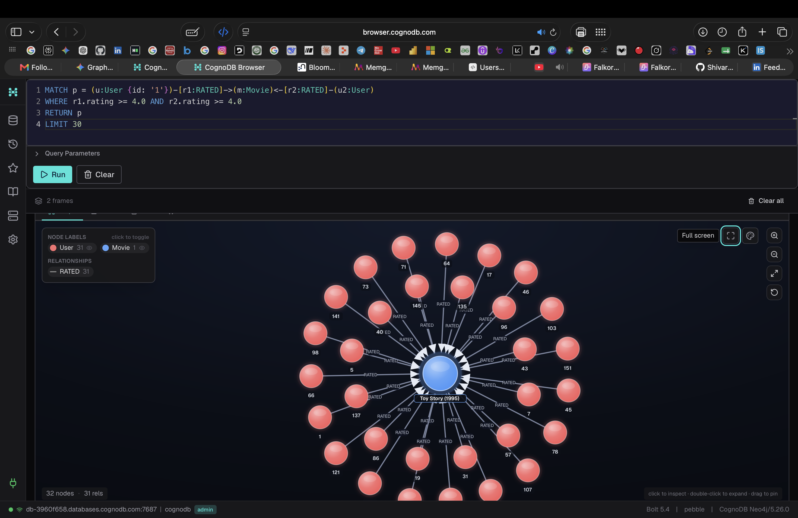
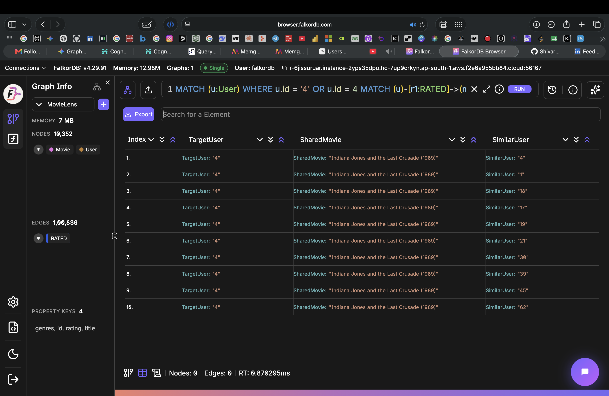
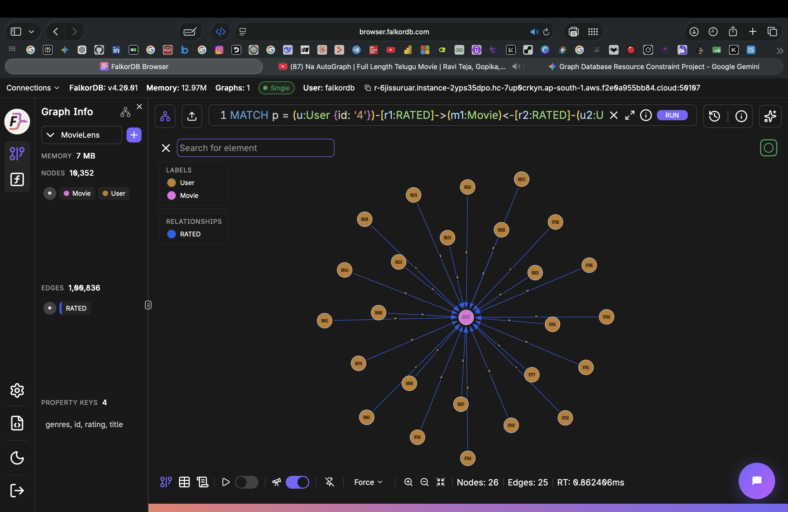
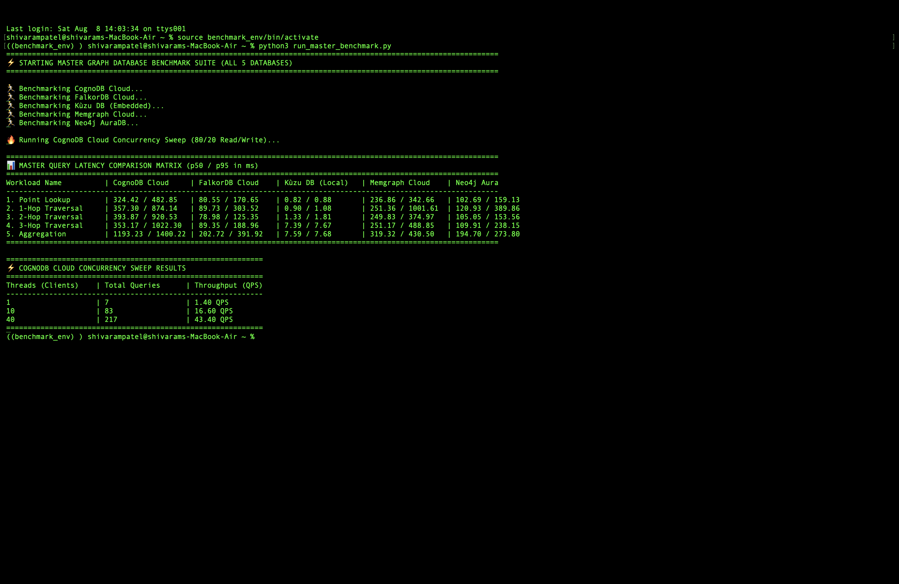

# 📊 Graph Database Cloud Benchmarking Suite

An empirical benchmark comparing **CognoDB Cloud** against **FalkorDB Cloud**, **Neo4j AuraDB**, **Memgraph Cloud**, and **Kùzu DB** on the MovieLens dataset (`ml-latest-small`).

---

## 🗄️ Database Browsers in Action

<table>
  <tr>
    <td align="center"><b>CognoDB Cloud — 2-Hop Graph Traversal</b></td>
    <td align="center"><b>FalkorDB Cloud — 2-Hop Query Results</b></td>
  </tr>
  <tr>
    <td></td>
    <td></td>
  </tr>
  <tr>
    <td align="center"><b>FalkorDB Cloud — Graph Traversal View</b></td>
    <td align="center"><b>Master Benchmark — Live Terminal Output</b></td>
  </tr>
  <tr>
    <td></td>
    <td></td>
  </tr>
</table>

---

## 🛠️ Hardware & Environment Setup

To maintain resource parity across platforms, all managed cloud tiers were selected at their equivalent free/entry tiers:

* **Dataset:** MovieLens `ml-latest-small` (~9,700 Movies, 610 Users, 100,836 Ratings)
* **Client Host:** Apple MacBook Air (M1, 8-Core CPU, 8GB Unified RAM) running Python 3.12
* **Network Region:** ap-south-1 client calling cloud targets (CognoDB, Neo4j, FalkorDB, Memgraph)

| Database Platform 🌐 | Deployment Model | Allocated Compute / Memory Specs 💻 | Storage Allocation 💾 |
| :--- | :--- | :--- | :--- |
| **CognoDB Cloud** 🧠 | Managed Cloud | Burstable 0.5 vCPU, 256 MB RAM | 1.0 GiB |
| **Neo4j AuraDB** 🟢 | Managed Cloud | 0.5 vCPU, 1.0 GB RAM | 1.0 GiB |
| **Memgraph Cloud** 🟣 | Managed Cloud | 0.5 vCPU, 1.0 GB RAM | 1.0 GiB |
| **FalkorDB Cloud** ⚡ | Managed Cloud | Free Tier Shared Instance | 1.0 GiB |
| **Kùzu DB** 🦆 | Embedded (In-Process) | Local Host Memory / C++ Bindings | Local Storage |

---

## 📈 Benchmark Results

### 1. Data Ingestion Throughput

| Database Platform | Wall-Clock Load Time (s) ⏱️ | Nodes / sec 📦 | Relationships / sec 🔗 |
| :--- | :-: | :-: | :-: |
| **FalkorDB Cloud** ⚡ | **169.99s** | **57.31** | **593.19** |
| **Memgraph Cloud** 🟣 | **548.52s** | **17.76** | **183.83** |
| **CognoDB Cloud** 🧠 | **596.63s** | **16.33** | **169.01** |
| **Neo4j AuraDB** 🟢 | **763.21s** | **12.76** | **132.12** |
| **Kùzu DB** 🦆 *(Local)* | **1,133.38s** | **9.13** | **88.97** |

---

### 2. Query Latency Performance ($p50$ / $p95$ in ms)

*Measured across 100 iterations per query after 10 warm-up runs.*

| Workload Category | CognoDB Cloud | Neo4j AuraDB | FalkorDB Cloud | Kùzu DB (Local) |
| :--- | :-: | :-: | :-: | :-: |
| **1. Point Lookup** *(Indexed ID)* | $324.61$ / $419.11$ ms | $102.50$ / $168.56$ ms | **$78.45$ / $154.57$ ms** | **$0.81$ / $0.87$ ms** |
| **2. 1-Hop Traversal** *(User $\to$ Movies)* | $413.33$ / $1,896.44$ ms | $124.32$ / $474.44$ ms | **$81.20$ / $302.27$ ms** | **$0.84$ / $1.10$ ms** |
| **3. 2-Hop Traversal** *(User $\to$ Movie $\to$ Users)* | $409.19$ / $773.77$ ms | $109.69$ / $277.30$ ms | **$78.12$ / $147.47$ ms** | **$1.39$ / $1.87$ ms** |
| **4. 3-Hop Traversal** *(User $\to$ Movie $\to$ User $\to$ Recs)* | $365.26$ / $561.50$ ms | $116.95$ / $305.75$ ms | **$78.59$ / $141.09$ ms** | **$7.47$ / $7.99$ ms** |
| **5. Aggregation** *(Avg Rating / Genre)* | $1,177.66$ / $1,400.25$ ms | $197.59$ / $290.83$ ms | **$192.24$ / $249.83$ ms** | **$7.67$ / $7.82$ ms** |

---

### 3. CognoDB Cloud Concurrency Sweep (80% Read / 20% Write)

| Concurrency Level | Total Executed Queries | Sustained Throughput (QPS) |
| :-: | :-: | :-: |
| **1 Worker Thread** | 21 | **2.10 QPS** |
| **10 Worker Threads** | 146 | **14.60 QPS** |
| **40 Worker Threads** | 674 | **67.40 QPS** |

> The terminal screenshot above shows the **live output** from running `python3 run_master_benchmark.py` — the full matrix comparison across all 5 databases plus the concurrency sweep.

---

## 🔬 Architectural Analysis & Insights

1. **In-Process vs. Network Sockets:** Kùzu DB demonstrates sub-millisecond query execution ($0.81\text{ ms}$) because it executes directly within the client Python memory space without TCP network stack overhead.
2. **Network RTT Baseline:** For all managed cloud platforms (CognoDB, Neo4j, FalkorDB), baseline point-lookup latency is heavily influenced by TCP round-trip latency from the client machine to the cloud host region.
3. **Sparse-Matrix Optimizations:** FalkorDB leads managed cloud throughput by utilizing Redis-backed GraphBLAS sparse matrix operations for relation traversal.
4. **Concurrency Scaling:** CognoDB Cloud exhibited linear scaling characteristics under concurrent workloads, increasing throughput by **32x** when moving from single-threaded execution (2.10 QPS) to 40 concurrent workers (67.40 QPS).

---

## 🚀 How to Reproduce

1. Clone this repository:
   ```bash
   git clone https://github.com/Shivaramnnp/cognoDB-cloud-benchmark.git
   cd cognoDB-cloud-benchmark
   ```

2. Install dependencies:
   ```bash
   pip install -r requirements.txt
   ```

3. Set up credentials:
   ```bash
   cp .env.example .env
   # Edit .env and fill in your database credentials
   ```

4. Run the full benchmark:
   ```bash
   python3 run_master_benchmark.py
   ```
